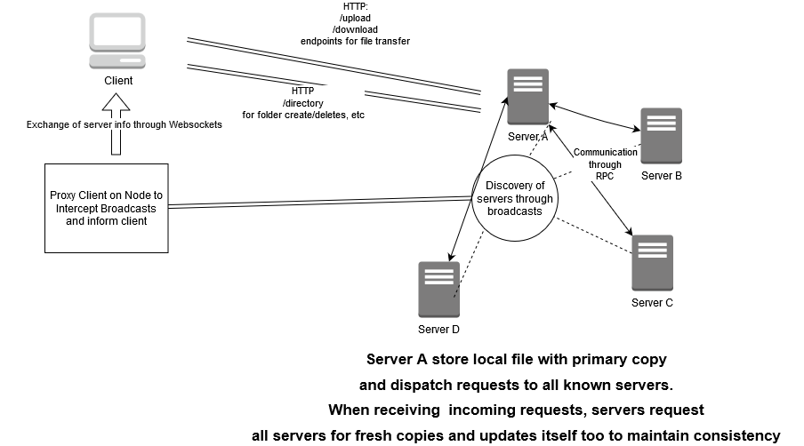

#  PocketFS

*PocketFS* is named after the pocket gopher, the mascot for the Go Programming Language and because of its lightweight and simplistic nature 

*PocketFS* is going to be a distributed file system which supports multiple nodes which can be added and removed dynamically and a client interface written in React that will interact with it.


*I may be smol but do not underestimate me!*

This document is divided in two sections:

- Part 1: The Architecture 
- Part 2:  Help / Usage Guidelines


To make the understanding of the file system easier I have decided to divide the distributed file system into several modules (or services, analogous in a SOA Service-Oriented Architecture) for easier understanding of the whole system.

## Broadcast Service (Discovery)

> Architecture Choice: Using a Fixed Set of Clients or centralized information or having a discovery based approach using messages.

I wanted to keep my application scalable, so that server nodes can easily be added and removed when needed, and even though one idea that could have been possible was that to have an initial configuration of nodes and once initial communication is established list of servers can be exchanged between servers and between clients.

Instead, I have adopted to use an approach that uses *UDP Broadcasts*\* in which whenever a server comes alive it sends a *HELLO: Im alive* signature message to the network. In response people know that this server has come alive and gives it the latest copy of the directory to achieve a consistent image across servers. 	

Once that's done it goes in *PING Mode* and pings its server signature so that all of the servers can be updated regarding the status of the node and for client side it is used to track the latency of the server which becomes helpful especially when client needs to query for files since it will always ask the server with the least amount of load.


*One of the things I plan to do in the future is to shift this to a multicast approach for more security and better performance.


## Directory Service

> *Architecture Choice: Using a Directory Tree vs Hash Table implementation*

One of the first choices I have to make is to decide on how will I store the files on my servers, both physical and logical representation needed to be catered to. 

Also it will be useful to mention here that in my case, I have included directories as special types of files usually with a flag associated with them and not created a separate data structure for them.

I have opted to use the hash-table approach, because it makes querying for files much faster we can get the desired ***O(1)*** run-time. However one notable exception I have to make is that since visually all of the files will be displayed as a tree , I needed to keep track  of the directory formulation i.e making sure that paths are formulated correctly so for example:

```
foo/bar/hello.txt
```

before being queried in the hash table needs to check that both foo and bar exist in the table as directories before I can query the file. This does not negatively impact the efficiency since although file names can be nested deep within directories there will be at most *K* levels of directories where we can reasonably assume that *K < N*  but cases can arise in deep nested directory trees in which searching will become slow.

## File Service

> Architecture Choice: Using a Upload/Download Model vs a Remote Access Model

For this I had to first decide on supporting the simplistic upload download model or the remote access model both of which have their pros and cons. While Upload/Download can prove to be slow especially in scenarios where file updates are frequent and not that drastic, but I have opted to choose the former for the following reasons:

- The use case of my application, is a web browser which has a directory tree showing and people can drag and drop their files and download the necessary ones. This use case exactly maps to the upload download model.
- The File Upload Model makes the contract between servers and servers and clients much simpler as the api knows that it will either receive a request to retrieve or publish the file. While file remote access can have more challenges since there is more finer control and establishing synchronized communication can become a challenge 

## File Transfer Service

Once a server receives a file request, it is then added to an asynchronous channel (go's terminology for a data transfer pipe) to the file transfer service. The file transfer service, which is running on a separate thread will remain blocked once it receives new File Requests to be added. once it receives it it will then call the FIle Message Service for each server available in its repository via RPC calls using TCP and then note down all of the successful responses it receives from each server in the form of a Quorum Counter

> Architecture Choice: Implementing a Read/Write Quorum for the application to maintain consitency or



**DISCLAIMER:**

While in this diagram it is clear that all file/directory requests are transferred immediately. It will be up to the receiving servers when to handle it since it is running on another thread and only once that thread comes into running (with new incoming data) will it get the latest copy of the files. However, leveraging multiple cores can be performant as this enables receival of new files simultaneously but no explicit guarantee can be made as to when the server will receive the file. Usage of mutexes however enables all of the concurrent transactions to be executed in a synchronized manner but the ordering cannot be guaranteed by the file system.